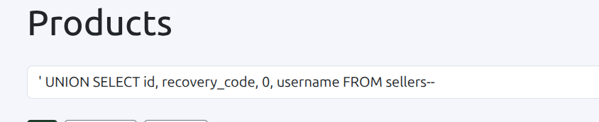
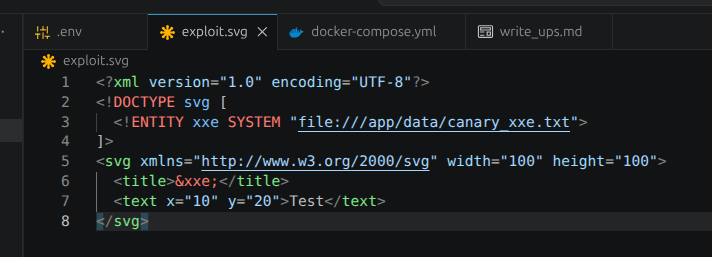
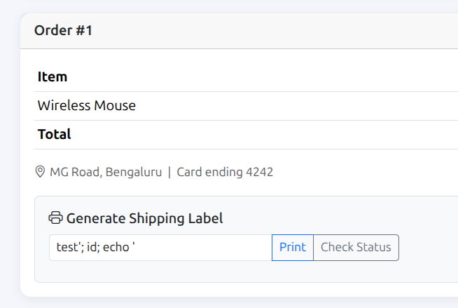
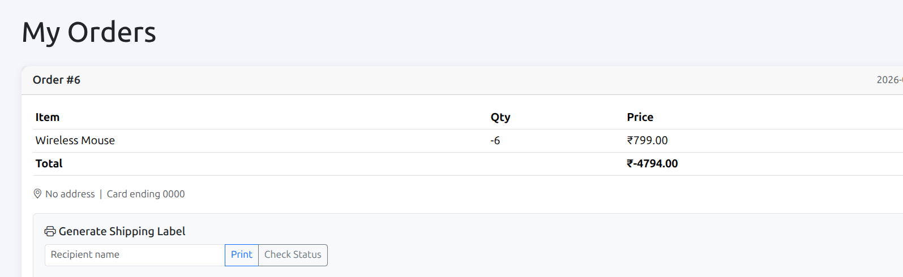

# ScalerKart CTF Writeups

## 1. UNION SQL Injection – Product Search

### Description

The product search functionality was vulnerable to UNION-based SQL Injection. User input was directly used in the SQL query without proper sanitization, allowing additional SQL statements to be appended.

### Steps to Reproduce

1. Open the product search page.
2. Intercept the request using Burp Suite.
3. Replace the search parameter with a UNION payload.
4. Forward the request.
5. The response returned data from another table.



**Payload**

```sql
' UNION SELECT id, recovery_code, 0, username FROM sellers--
```

### Impact

* Sensitive database information can be exposed.
* Attackers may retrieve confidential records from other tables.

### Remediation

* Use parameterized queries.
* Validate and sanitize all user input.
* Avoid constructing SQL queries using string concatenation.

### CVSS Score

**CVSS v3.1:** 7.5 (High)

---

## 2. XXE via SVG Product Image

### Description

The application parsed uploaded SVG files with external entity resolution enabled. This allowed XML External Entity (XXE) injection and reading of local files from the server.

### Steps to Reproduce

1. Login as a seller.
2. Open the product image upload page.
3. Upload a malicious SVG containing an external entity.
4. The server processed the entity and returned sensitive file contents.



### Impact

* Local file disclosure.
* Possible exposure of application secrets or configuration files.

### Remediation

* Disable external entity resolution.
* Use secure XML parsers.
* Validate uploaded SVG files before processing.

### CVSS Score

**CVSS v3.1:** 6.5 (Medium)

---

## 3. Blind Command Injection – Shipping Label

### Description

The shipping label generation feature executed user input inside a system command without proper validation. By injecting shell characters, additional commands could be executed on the server.

### Steps to Reproduce

1. Place an order.
2. Open the shipping label generation feature.
3. Modify the recipient name with a command injection payload.
4. Generate the label.
5. Observe changes in the command output.



**Payload**

```text
test'; id; echo '
```

### Impact

* Remote command execution.
* Server information disclosure.
* Potential full server compromise.

### Remediation

* Never execute user input inside shell commands.
* Use safe system APIs instead of shell execution.
* Validate and escape all user-controlled input.

### CVSS Score

**CVSS v3.1:** 8.8 (High)

---

## 4. Business Logic – Negative Quantity Cart

### Description

The cart allowed negative product quantities. During checkout, the application calculated a negative total instead of validating the quantity, resulting in an invalid purchase flow.

### Steps to Reproduce

1. Add a product to the cart.
2. Change the quantity to a negative value.
3. Proceed to checkout.
4. Observe that the total becomes negative.



### Impact

* Incorrect billing.
* Financial loss.
* Abuse of the checkout process.

### Remediation

* Reject zero or negative quantities.
* Perform server-side validation before checkout.
* Validate cart totals before creating an order.

### CVSS Score

**CVSS v3.1:** 5.3 (Medium)
